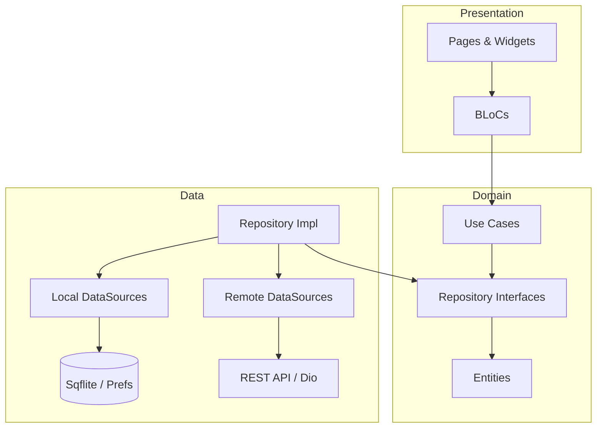

# 🎓 SmartCampus Companion

[](https://flutter.dev)
[](https://dart.dev)
[](https://opensource.org/licenses/MIT)
[](https://flutter.dev)

**SmartCampus Companion** is a feature-rich university management mobile application built with Flutter. It serves as a comprehensive digital assistant for students and staff, integrating campus services, real-time notifications, and interactive maps into a single, seamless experience.

---

## 📸 App Preview

<p align="center">
  
  
  
  

</p>

---

## ✨ Key Features

### 🔐 Security & Identity
- **Multi-Factor Auth**: Secure email/password login coupled with Biometric (Fingerprint/FaceID) support.
- **Secure Vault**: Sensitive user data and tokens are encrypted using `FlutterSecureStorage`.
- **Role-Based Access**: Specialized interfaces for Students, Staff, and Administrators.

### 📍 Campus Navigation
- **Interactive Maps**: Real-time Google Maps integration with custom markers for campus buildings, dining halls, and sports facilities.
- **Location Intelligence**: Track your real-time position on campus and find the nearest points of interest.

### 📅 Academic Management
- **Smart Timetable**: Dynamic class schedules with automated reminders via local notifications.
- **Offline First**: All academic data is cached locally using `Sqflite`, ensuring access even without an internet connection.

### 📢 Communication Hub
- **Instant Announcements**: Real-time broadcast of campus news and urgent alerts.
- **Event Management**: Browse upcoming campus events and check-in instantly using QR codes.

### 🌍 Global Reach
- **Multi-lingual Support**: Full localization for **English**, **French**, and **Arabic** (RTL support).
- **Dynamic Theming**: Elegant Light and Dark modes that respect system preferences.

---

## 🛠️ Technical Stack

- **Framework**: [Flutter](https://flutter.dev) & [Dart](https://dart.dev)
- **State Management**: [Bloc (Flutter Bloc)](https://pub.dev/packages/flutter_bloc)
- **Navigation**: [GoRouter](https://pub.dev/packages/go_router)
- **Local Database**: [Sqflite](https://pub.dev/packages/sqflite)
- **Service Locator**: [GetIt](https://pub.dev/packages/get_it)
- **Networking**: [Dio](https://pub.dev/packages/dio)
- **Maps**: [Google Maps Flutter](https://pub.dev/packages/google_maps_flutter)
- **Background Tasks**: [Workmanager](https://pub.dev/packages/workmanager)


---

## Project Structure

```
lib/
├── core/
│   ├── background/       # Background task management
│   ├── constants/        # App constants
│   ├── errors/           # Exception classes
│   ├── lifecycle/        # App lifecycle observer
│   ├── navigation/       # Router configuration
│   ├── network/          # Dio client
│   ├── notifications/    # Notification service
│   ├── permissions/      # Permission handler
│   ├── storage/          # Secure storage & database
│   ├── theme/            # App theme
│   └── utils/            # Utilities & DI
├── data/
│   ├── datasources/      # Local & remote datasources
│   ├── models/           # Data models
│   └── repositories/     # Repository implementations
├── domain/
│   ├── entities/         # Business entities
│   ├── repositories/     # Repository interfaces
│   └── usecases/         # Use cases
├── presentation/
│   ├── bloc/             # BLoCs
│   ├── pages/            # UI pages
│   └── widgets/          # Reusable widgets
└── main.dart             # Entry point
```


---

## 🏗️ Architecture

The project adheres to **Clean Architecture** principles, ensuring scalability, maintainability, and testability.




---

## 📱 Mobile OS Concepts

| Concept | Implementation |
| :--- | :--- |
| **Lifecycle** | Managed via `AppLifecycleObserver` to refresh data and handle app states. |
| **Permissions** | Runtime requests for Camera (QR), Location (Maps), and Biometrics. |
| **Persistence** | Multi-layer storage (Secure Storage for tokens, SQL for data, Prefs for settings). |
| **Multitasking** | Background task execution using `Workmanager` for data synchronization. |
| **Inter-app Comm** | Deep linking support and standard platform-specific intents. |

---

## 🚀 Getting Started

### Prerequisites
- Flutter SDK (>= 3.0.0)
- Google Maps API Key (for Android & iOS)

### Installation

1. **Clone the Repo**
   ```bash
   git clone https://github.com/yourusername/smartcampus_companion.git
   cd smartcampus_companion
   ```

2. **Setup API Keys**
   - Add your Google Maps API Key in `android/app/src/main/AndroidManifest.xml`.
   - Add your Google Maps API Key in `ios/Runner/AppDelegate.swift`.

3. **Install Dependencies**
   ```bash
   flutter pub get
   ```

4. **Run Application**
   ```bash
   flutter run
   ```

---

## 🗺️ Roadmap
- [ ] **AI Assistant**: Integrate a campus-specific chatbot for student queries.
- [ ] **AR Navigation**: Augmented Reality pathfinding for indoor campus navigation.
- [ ] **Meal Plan Integration**: Digital wallet for cafeteria payments.
- [ ] **Real-time Bus Tracking**: Integration with campus shuttle GPS.

---

## 📄 License

This project is licensed under the MIT License - see the [LICENSE](LICENSE) file for details.

---

## 🤝 Contact

For any inquiries or feedback, please reach out:
- **Project Lead**: [Your Name](https://github.com/AbdeldjalilNe)
- **Email**: [EMAIL_ADDRESS][abdeledjalil.nemouchi@univ-constantine2.dz]
- **Issue Tracker**: [GitHub Issues](https://github.com/AbdeldjalilNe/Flutter_SmartCampus/issues)

<p align="center">Made with ❤️ for the SmartCampus Community</p>
